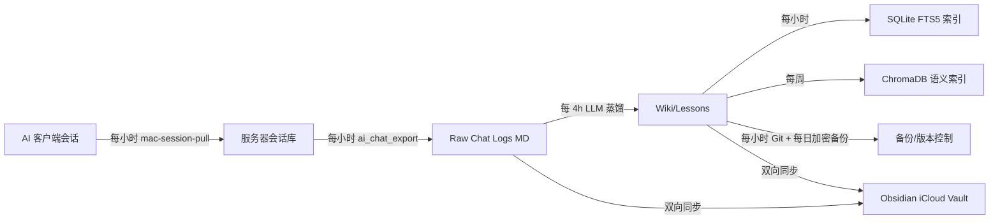

# AI × Obsidian 第二大脑生态

<p align="center"><b>把多个 AI 客户端（Claude Code / Codex / Pi / Hermes / DSH…）的聊天会话，自动沉淀为一个可搜索、可追溯、可自生长的个人知识库（Second Brain）。</b></p>

<p align="center">
  <a href="LICENSE"></a>
  
  
</p>

---

## 🧭 30 秒看懂（给第一次来的人）

**你每天用 AI 工具（Claude Code、Codex、Pi…）干活、聊天、写代码。这些对话里藏着大量有价值的东西——踩过的坑、验证过的方案、做过的决策。但它们散落在各个工具的本地会话文件里，过几天就再也找不回来。**

这个项目做的事：

```text
你照常用 AI 干活（什么都不用额外做）
        ↓ 服务器每小时自动拉取各 AI 的聊天记录
        ↓ 自动清洗、脱敏、导出成统一格式
        ↓ 每 4 小时用一个 LLM「蒸馏」：从聊天里提炼出概念、经验、决策
        ↓ 写进你的 Obsidian 知识库（可搜索、可链接、可追溯）
        ↓ 自动 Git 提交 + 加密备份
```

**一句话**：装好后，你继续照常用 AI，知识库自己长出来。

### 装好后你会得到什么（效果）

你的 Obsidian Vault 里会**自动出现**这些内容（无需手写）：

```text
Vault/
├── Codex/Chat Logs/2026/2026-08-14.md      ← 当天所有 Codex 对话（自动导出）
├── Claude/Chat Logs/2026/2026-08-14.md     ← 当天所有 Claude 对话
├── Wiki/
│   ├── Concepts/「期权因子评分体系」.md      ← 从对话里提炼的概念页
│   ├── Entities/「Hermes」.md               ← 工具/项目实体页
│   ├── Topics/「美股期权策略系统」.md        ← 跨天的长期主题综述
│   └── Log.md                              ← 每次蒸馏的变更日志（可审计）
├── Codex/Lessons/「XX 踩坑排查」.md          ← 可复用的经验卡
└── Shared/Lessons/「YY 通用经验」.md         ← 跨工具通用经验
```

以后你可以：在 Obsidian 里全文搜索、按双链跳转、问 AI「我上个月解决 XX 问题是怎么做的」——它直接读 Wiki 层回答，而不是翻几十个聊天文件。

### 成本与门槛（先看这个再决定）

| 项目 | 要求 | 说明 |
|---|---|---|
| 💻 硬件 | 一台 7×24 开机的 Linux 服务器（本仓库自动化核心） | 家里闲置的旧电脑/NAS/云主机都行；没有的话这套跑不起来 |
| 🖥️ 工作站 | 一台 Mac（跑 AI 客户端） | 只需开 SSH，服务器主动拉数据 |
| 💰 金钱 | 服务器电费 + **一个可调用的 LLM API**（用于蒸馏） | 蒸馏每 4h 跑一次，用量很小；也可用你已有的 ChatGPT 订阅 |
| ⏱️ 时间 | 首次部署 1~2 小时（照教程走） | 之后全自动，零维护（有自愈机制） |
| 🛠️ 技能 | 会复制粘贴命令、会用 vim 改一行配置 | 不需要会编程；但完全没碰过命令行的用户会吃力 |

**你不适合用这个项目，如果**：

- 没有（也不想要）一台常开的 Linux 服务器 → 考虑用 Obsidian 官方的 Sync + 手动笔记
- 完全不想碰命令行 → 这个项目需要最小限度的终端操作
- 不想为蒸馏付任何 API 费用 → 蒸馏是核心功能，必须有一个 LLM 可用

> 架构总览见 [docs/architecture.md](docs/architecture.md)（含完整链路图）；从零开始见 [docs/quickstart.md](docs/quickstart.md)（保姆级教程）；常见问题见 [docs/faq.md](docs/faq.md)。

---

## 这是什么

一套**自托管、多 Agent、数据归己**的个人知识管理系统：

- **输入**：多个 AI 编码/对话客户端的会话记录（Claude Code、OpenAI Codex、Pi、Hermes 微信/Telegram 网关、DeepSeek Harness…）
- **管道**：服务器每小时拉取所有机器的会话 → 导出为统一 Raw Markdown → 每 4 小时用 LLM 蒸馏为结构化知识（概念 / 实体 / 主题 / 经验卡）
- **存储**：纯 Markdown + Obsidian（本地优先，iCloud 同步），SQLite FTS5 全文索引 + ChromaDB 语义索引
- **沉淀**：冲突观点并列保留、来源可追溯、变更可审计；每天自动 Git 提交 + 加密备份

核心设计理念：

- **Raw / Wiki / Schema 三层架构**：原始证据只读，AI 只增量维护结构化理解层，规则层约束 AI 不乱建乱改
- **Exporter 翻译、Distiller 只认统一格式**：新增一个 AI 客户端只需写一个导出器，蒸馏/索引/备份零改动
- **服务器 7×24 为核心，Mac 是可替换工作站**：Mac 关机不影响任何核心能力
- **本地可控、数据归己**：不依赖任何单一 AI 公司的云存储

## 仓库结构

```text
.
├── README.md                    # 本文件
├── docs/
│   ├── quickstart.md            # ★ 保姆级教程（新手先看这个）
│   ├── faq.md                   # ★ 常见问题
│   ├── AI-CLIENTS.md            # 前置条件：AI 客户端安装
│   ├── architecture.md          # 完整架构与真实链路
│   ├── vault-structure.md       # 知识库目录结构
│   ├── knowledge-layer.md       # Raw-Wiki-Schema 三层知识库设计
│   ├── deployment.md            # 部署手册（深入版）
│   ├── join-flow.md             # 新机器加入流程
│   ├── distill-pipeline.md      # 蒸馏管道详解
│   ├── self-heal.md             # 自愈机制
│   ├── security.md              # 安全、脱敏与密钥管理
│   └── client-onboarding.md     # 新增 AI 客户端的接入清单
├── scripts/                     # 脱敏后的核心脚本模板（可直接改造使用）
│   ├── mac-session-pull.sh      #   多机会话拉取（Claude/Codex/Pi/DSH）
│   ├── vault-pull.sh            #   iCloud Vault 拉取
│   ├── ai_chat_export.py        #   统一导出器（Claude/Pi/DSH → Raw Markdown）
│   ├── ai_chat_unified_distill_cron.sh  #   统一蒸馏（Raw → Wiki/Lessons）
│   ├── obsidian_backup.py       #   SQLite FTS5 索引
│   ├── wiki_ingest.py           #   URL/文件/文本入库
│   ├── redact_secrets.py        #   敏感信息识别与脱敏
│   └── …（详见 scripts/README.md）
├── templates/                   # Obsidian Wiki 页模板 + systemd 单元模板
├── tests/smoke.sh               # 冒烟测试（沙箱端到端验证核心链路）
└── LICENSE
```

## 开发与测试

```bash
# 冒烟测试：在临时沙箱里跑 setup-server / autocommit / node-discovery，
# 不碰真实 systemd/crontab/vault，任何一次改动后建议跑一遍
bash tests/smoke.sh
```

## 快速上手

### 前置条件

**基础设施**
- 一台 7×24 常开的 Linux 服务器（本仓库的自动化核心）
- 一台或多台 Mac 工作站（跑 AI 客户端，只需开 SSH）
- Obsidian（本地编辑入口，可选但推荐）

**⭐ 消息网关（本系统最大价值，强烈建议第一个装）**
- Hermes Gateway：7×24 接入微信/Telegram → 手机随时指挥 AI + 聊天自动沉淀 + 定时简报推送 + 系统事件通知
- 微信 vs Telegram 选型、能做什么、踩坑 → 见 [docs/gateway.md](docs/gateway.md)

**AI 客户端（按你实际用的装，全部可选——用哪个装哪个，不用的不装）**

> 核心原则：**没有哪个客户端是必须的**。系统按「目录存在才拉取」容错设计，你只装自己日常在用的工具即可；只装一个也能跑。

- Claude Code：`npm install -g @anthropic-ai/claude-code`，登录 Claude 账号（可选）
- OpenAI Codex：`npm install -g @openai/codex`，登录 OpenAI/ChatGPT 账号（可选）
- Pi：`npm install -g @voussoir/pi`，登录账号（可选）
- DeepSeek Harness（DSH）：我们自己在用的 AI 环境，已内置接入（可选）
- 蒸馏用 LLM：**唯一必须的模型依赖**——至少一个可调用的模型 provider（OpenAI/Anthropic/DeepSeek/Kimi/Z.AI 任一），用于把聊天记录蒸馏成知识

> 客户端安装细节见 [docs/AI-CLIENTS.md](docs/AI-CLIENTS.md)

### 三步接入

```bash
# 1. 克隆本仓库到服务器
git clone <your-fork> && cd <repo>

# 2. 配置环境（替换所有 <PLACEHOLDER>）
cp .env.example .env && vim .env   # 填入你的服务器/主 Mac 信息

# 3. 参考 docs/deployment.md 部署 systemd timers 与 cron
```

### 一键部署

```bash
# setup-server.sh 会读取 .env，创建 systemd timers 和 cron
cp .env.example .env && vim .env
bash scripts/setup-server.sh
```

### 新增一个 AI 客户端

见 [docs/client-onboarding.md](docs/client-onboarding.md)——目前按清单接入一个全新客户端（如 Gemini CLI / Cursor）约需改动 3 处：

1. `mac-session-pull.sh`：加一个会话目录的 rsync
2. `ai_chat_export.py`：写一个 `xxx_records()` 生成器并注册
3. 验证蒸馏能读到（通常零改动）

## 核心工作流



## 安全说明

- 本仓库所有脚本已**脱敏**：真实 IP、用户名、路径一律替换为 `<PLACEHOLDER>`
- 生产脚本内置 `redact_secrets.py`：写入 Raw 前自动把 API key / token / 密码加密进系统密钥链（macOS Keychain），vault 内只留脱敏引用
- 服务器侧（无 Keychain）遇密钥 fail-closed 写入 `UNSTORED-` 引用，绝不落明文

## 为什么开源

这套系统是从真实使用中长出来的，踩过不少坑（多副本 Vault 漂移、AI 幻觉入库、双向同步误删、蒸馏 provider 降级链…）。开源是为了：

1. 给同样想自建 AI 知识库的人一个**可运行的起点**，而不是零散的文章
2. 让架构接受社区检验——尤其是安全、同步、蒸馏可靠性这些容易翻车的环节
3. 拆掉「第二大脑」的神秘感：它本质是一堆可审计的 bash/python + Markdown

## 相关项目

- [kepano/obsidian-skills](https://github.com/kepano/obsidian-skills) — Obsidian 官方 Agent Skills（markdown / defuddle / cli 等）
- [rasbt/LLMs-from-scratch](https://github.com/rasbt/LLMs-from-scratch) — LLM 原理学习

## License

MIT（见 [LICENSE](LICENSE)）
